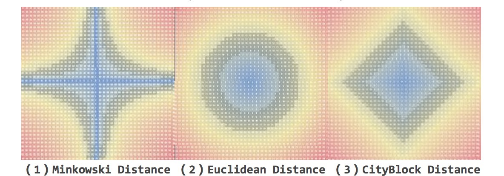

使用非均匀量化处理图像数据
---

这篇文章其实也算是 "信息编码论" 的一个课程作业的总结吧. 因为之前对图像的处理, 基本都是作为一个 lib-caller , 对其中的原理部分一知半解.

正好研究生有这么个选修课程, 于是就硬着头皮选修了. 然后其中的一个实验就是要求实现一个 jpeg 压缩算法. 然后比较每个人的压缩效率, 同时还要比较信噪比.

所以正好有这个机会可以来尝试下好玩的部分.

我们首先拿到的数据是是 raw 文件. 一个 262144(512x512) bytes 的 raw 文件. 通过样例代码跑出来. 是著名的 Lena 图:

> 

说道 raw 文件, 其实也很好理解, 这是最原始的图像数据, 其实就是一个 512x512 的二维数组, 每个点的数据为 0~255 的灰度值(现在只是黑白图片).

然后我们的任务就是使用各种可能的量化手段来进行图像的压缩. 为什么需要量化, 因为相比较于后期的压缩算法而言(在此也就是 jpeg 算法, 后面有机会再写), 分布越少, 后期的压缩效率更高. 所以, 这边开始最前期处理.

首先就是比较 low 的均匀量化. 将 0-255 均匀地分成四个部分 (0-64, 64-128, 128-192, 192-255). 然后将对应的中点值分别写入到对应的位置. 然后再跑一遍 jpeg 压缩算法. 可以得到均匀量化的图像:

> 

当然, 结果也非常好, 信噪比也有: 22.88 , 在没有使用量化手段的情况下, jpeg 压缩为 262kb -> 66kb, 使用均匀量化之后, 最后的结果是 33kb. 节省了 50% 的空间.

然后就是重头戏了. 那就是非均匀量化. 以上, 我们都只是采用了人为设定的中心点, 进行强行的划分. 所以必然的一个结果就是, 并不能很好地表现出点的分布特性. 而最好的表现点的分布特性的算法莫过于聚类. 然后聚类中, 最常用的便是 k-means 算法.

但是, 在信息论领域, 有一个类似的但是名字不同的算法, 那就是 [Lloyd 算法](https://en.wikipedia.org/wiki/Lloyd%27s_algorithm). 对应的数学表达是;

> 

其实就是 k-means ...

所以这边使用了这个算法进行设计. 也是从四个开始. 设定初始的四个中心之后, 跑一遍代码, 最后得到这样的一个结果:

> 

可以看到已经好了很多, 对应的信噪比是: 25.98 了.

之后,为了更好地提高信噪比, 就人为地多设定几个初始点. 当达到 8 个的时候:

> 

此时的结果已经很棒了. 信噪比达到了 31.68. 但是, 对应的理论结果就是图像结果变大, 但是实际上, 它是最小的一个. 具体的原因, 之后会写一篇关于 jpeg 算法的文章分析.

此时, 基本就明白了自己的大概思路, 为了写这个课程作业. 只需要不断地改变 kmeans 的初始点位, 找到最优解即可. 但是人工写太过麻烦. 所以我们有了 [Kmeans++ 算法](http://rosettacode.org/wiki/K-means%2B%2B_clustering).

用它可以确定最优的 k 值.

基本这样, 课程的作业也能完成了. 但是, 为了追求优秀, 就要从一维的结果推广到 N 维. 也就是在多维空间的聚类算法.

其中, 最常用的就是最近邻算法(NN). 通常情况, 我们有三种进行距离判断的函数:

+ Minkowski Distance
+ Euclidean Distance
+ CityBlock Distance

这三种近邻算法分别可以拿到如下的几个中心:

> 

当数据到了多维之后, 就到了乘积量化. 乘积量化正好是我课程论文最后的主要内容. 其实也是一个简单地算法. 主要的原理就是分治. 将多维空间拆成多个低维空间, 然后分别求出不同低维空间的中心点. 然后通过笛卡尔积的方式, 求出多维空间的中心点阵. 最后通过排除法选出最优解.

这个的话, 之后可能有机会会再写个文章纪念下.

最后附一个测试代码:

```
/******************************************************************************
    Copyright © 2017 TangDongxin

    Permission is hereby granted, free of charge, to any person obtaining
    a copy of this software and associated documentation files (the "Software"),
    to deal in the Software without restriction, including without limitation
    the rights to use, copy, modify, merge, publish, distribute, sublicense,
    and/or sell copies of the Software, and to permit persons to whom the
    Software is furnished to do so, subject to the following conditions:

    The above copyright notice and this permission notice shall be included
    in all copies or substantial portions of the Software.

    THE SOFTWARE IS PROVIDED "AS IS", WITHOUT WARRANTY OF ANY KIND,
    EXPRESS OR IMPLIED, INCLUDING BUT NOT LIMITED TO THE WARRANTIES
    OF MERCHANTABILITY, FITNESS FOR A PARTICULAR PURPOSE AND NONINFRINGEMENT.
    IN NO EVENT SHALL THE AUTHORS OR COPYRIGHT HOLDERS BE LIABLE FOR ANY CLAIM,
    DAMAGES OR OTHER LIABILITY, WHETHER IN AN ACTION OF CONTRACT,
    TORT OR OTHERWISE, ARISING FROM, OUT OF OR IN CONNECTION WITH THE SOFTWARE
    OR THE USE OR OTHER DEALINGS IN THE SOFTWARE.
******************************************************************************/

#include <assert.h>
#include <ctype.h>
#include <errno.h>
#include <float.h>
#include <iso646.h>
#include <limits.h>
#include <locale.h>
#include <math.h>
#include <setjmp.h>
#include <signal.h>
#include <stdarg.h>
#include <stddef.h>
#include <stdio.h>
#include <stdlib.h>
#include <string.h>
#include <time.h>
#include <wchar.h>
#include <wctype.h>

#define ROWS 512
#define COLS 512

uint8_t belongs[ROWS][COLS];

/* calc the psnr */
double calc_psnr(uint8_t origin[COLS][ROWS], uint8_t output[COLS][ROWS]) {
    uint64_t i, j;
    double PSNR = 0, MSE = 0, MAXI = 255;
    for (i = 0; i < COLS; i++) {
        for (j = 0; j < ROWS; j++) {
            MSE += (origin[i][j] - output[i][j]) * (origin[i][j] - output[i][j]);
        }
    }
    MSE = MSE/(ROWS*COLS);
    printf("MSE: %f\n", MSE);
    PSNR = 20*log10(MAXI) - 10*log10(MSE);
    return PSNR;
}

/* find the cluster the point belong to */
int choose_center(uint8_t *center, int n, uint8_t x) {
    int i, min_d = INT_MAX, res = 0;
    for (i = 0; i < n; i++) {
        if (min_d > abs(x - center[i])) {
            min_d = abs(x - center[i]);
            res = i;
        }
    }
    return res;
}

/* calc the new center */
void calc_center(uint8_t points[ROWS][COLS], uint8_t *center, int n) {
    int k, i, j;
    for (k = 0; k < n; k++) {
        int64_t x = 0, cnt = 0;
        for (i = 0; i < ROWS; i++) {
            for (j = 0; j < COLS; j++) {
                if (belongs[i][j] == k) {
                    x += points[i][j];
                    cnt++;
                }
            }
        }
        if (cnt > 0) {
            center[k] = x / cnt;
        }
    }
}

/* sum the distance in the cluster */
int64_t sum_distance(uint8_t points[ROWS][COLS], uint8_t *center) {
    int64_t i, j, sum = 0;
    for (i = 0; i < ROWS; i++) {
        for (j = 0; j < COLS; j++) {
            sum += abs(center[belongs[i][j]] - points[i][j]);
        }
    }
    return sum;
}


int main() {
    uint8_t input[ROWS][COLS];
    uint8_t output1[ROWS][COLS];
    uint8_t output2[ROWS][COLS];
    uint8_t output3[ROWS][COLS];

    FILE *infd = fopen("lena512.raw","rb");
    FILE *outfd1 = fopen("lena512.uq.raw","wb");
    FILE *outfd2 = fopen("lena512.kmeans.4.raw","wb");
    FILE *outfd3 = fopen("lena512.kmeans.8.raw","wb");

    fread(input, sizeof(uint8_t), ROWS*COLS, infd);
    fclose(infd);

    int64_t i, j;
    for (i = 0; i < ROWS; i++) {
        for (j = 0; j < COLS; j++) {
            if (0 <= input[i][j] && input[i][j] < 64) {
                output1[i][j] = 32;
            } else if (64 <= input[i][j] && input[i][j] < 128) {
                output1[i][j] = 96;
            } else if (128 <= input[i][j] && input[i][j] < 192) {
                output1[i][j] = 160;
            } else {
                output1[i][j] = 224;
            }
        }
    }
    printf("PSNR: %f\n", calc_psnr(input, output1));

    fwrite(output1, sizeof(uint8_t), ROWS*COLS, outfd1);
    fclose(outfd1);


    /* 4 cluster */
    memset(belongs, 0, sizeof(belongs));
    uint8_t *center = (uint8_t *)malloc(sizeof(uint8_t) * 4);
    center[0] = 4;
    center[1] = 6;
    center[2] = 120;
    center[3] = 205;

    int minE = INT_MAX;
    while (sum_distance(input, center) < minE) {
        minE = sum_distance(input, center);
        for (i = 0; i < ROWS; i++) {
            for (j = 0; j < COLS; j++) {
                belongs[i][j] = choose_center(center, 4, input[i][j]);
            }
        }

        calc_center(input, center, 4);
    }
    printf("the new center:\n");
    for (i = 0; i < 4; i++) {
        printf("%d, ", center[i]);
    }
    printf("\n");

    for (i = 0; i < COLS; i++) {
        for (j = 0; j < ROWS; j++) {
            output2[i][j] = center[belongs[i][j]];
        }
    }
    printf("PSNR: %f\n", calc_psnr(input, output2));

    fwrite(output2, sizeof(uint8_t), ROWS*COLS, outfd2);
    fclose(outfd2);

    /* 8 cluster */
    memset(belongs, 0, sizeof(belongs));
    free(center);

    center = (uint8_t *)malloc(sizeof(uint8_t) * 8);
    center[0] = 20;
    center[1] = 60;
    center[2] = 120;
    center[3] = 149;
    center[4] = 200;
    center[5] = 205;
    center[6] = 5;
    center[7] = 235;

    minE = INT_MAX;
    while (sum_distance(input, center) < minE) {
        minE = sum_distance(input, center);
        for (i = 0; i < ROWS; i++) {
            for (j = 0; j < COLS; j++) {
                belongs[i][j] = choose_center(center, 8, input[i][j]);
            }
        }

        calc_center(input, center, 8);
    }
    printf("the new center:\n");
    for (i = 0; i < 8; i++) {
        printf("%d, ", center[i]);
    }
    printf("\n");
    for (i = 0; i < COLS; i++) {
        for (j = 0; j < ROWS; j++) {
            output3[i][j] = center[belongs[i][j]];
        }
    }
    printf("PSNR: %f\n", calc_psnr(input, output3));

    fwrite(output3, sizeof(uint8_t), ROWS*COLS, outfd3);
    fclose(outfd3);
    return 0;
}
```
