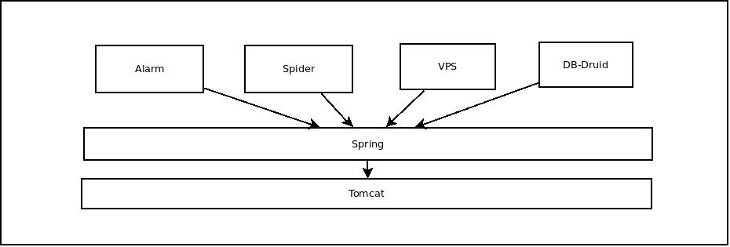

关于容器的新的看法
----
关于Java中的容器，大家因该第一个想到的是Tomcat，毕竟这应该是学习Java中的第一个容器（如果玩Java Web的话）。在经历了第一个项目和第二个项目之后，我才开始体会到容器的
必要性。

在此之前，我之前的所有的Java程序都是指定main函数的runnable jar package。这样做确实简单。而且快捷。但是有一个很明显的缺点，就是你无法控制他的生命周期。举一个很
简单的例子，如果程序挂了，除了运气比较好去top或者ps一把发现没有这个进程之外，貌似没有好的办法了（此处不考虑心跳协议）。还有一点，程序的可装配性比较差。需要在
main函数里指定加载的顺序。凡此种种，都是因为我们将程序直接泡在了jvm上，而jvm并没有在java层面上给我们过多的api接口。所以，为了改变这个状况，我们在jvm上又加了一个
容器。

所以，简单地说，容器的作用就是一个脸盆，程序就像是一个一个土豆，然后程序的运行就像是在脸盆里煮土豆。如果土豆煮过头了，脸盆就可以最先发现，同时，土豆爆炸了，脸盆也最先知道。

就拿这次的爬虫程序来说，我们本来可以用一个简单的jar程序就可以实现，但是考虑到爬虫的状态获取和报警机制，还是将爬虫扔到了tomcat中，同时，由于有多个模块的组合，我们又
通过spring进行了粘合。所以，爬虫看起来就是这样的一个架构：

> 

所有线程的生命周期都被tomcat控制着。在爬虫阵亡的时候，或者Tomcat OOM跪了的时候，只要我们继承了ServletContextListener这个接口，如下的方法必定执行。

```
	/**
	 ** Notification that the servlet context is about to be shut down.
	 ** All servlets and filters have been destroy()ed before any
	 ** ServletContextListeners are notified of context
	 ** destruction.
	 */
    public void contextDestroyed ( ServletContextEvent sce );
```

所以，在这边我们就可以加入报警的代码。

然后，对于不同的模块，我们如何进行拼装呢？那就更加方便了，因为Spring的特性，我们可以通过配置bean的方式，让spring去安排模块的启动，具体的配置就是spring的事情了。比如一个最简单的
bean的启动配置：

```
	<!--IP池 -->
	<bean id="ipPool" class="com.mogujie.crawler.http.IpPool">
		<property name="configFile" value="${ip.config.file}" />
		<property name="isLoadFromDB" value="${ip.config.isLoadFromDB}" />
	</bean>

	<!-- HTTP工厂 -->
	<bean id="httpProvider" class="com.mogujie.crawler.http.HttpProvider">
		<property name="ipPool" ref="ipPool" />
		<property name="userAgentConfigFile" value="${user.agent.config.file}" />
		<property name="spiderTypeMap">
			<map>
				<!--
				<entry key="美丽说" value="http://www.meilishuo.com/welcome" />
				<entry key="LC风格网" value="http://www.linkchic.com/items.html" />
				<entry key="堆糖" value="http://www.duitang.com/shopping/" />
				 -->
			</map>
		</property>
	</bean>
```

确切的说，是一个一一对应的bean配置。通过如下的一个服务工厂实现生产者模式：

```
/**
 *
 * 功能描述：服务工厂，线程安全的懒汉单例
 *
 * @author liuchuanshuang.neil time : 2011-8-2 下午06:08:22
 */
public class ServiceFactory implements ApplicationContextAware {

	private ApplicationContext appContext;

	private static ServiceFactory instance = null;

	private ServiceFactory() {
	}

	public static <T> T getService(Class<T> service) {
		if (service == null) {
			return null;
		}

		return (T) instance.appContext.getBean(service);
	}

	@SuppressWarnings("unchecked")
	public static <T> T getBeanByName(String beanName) {
		return (T) instance.appContext.getBean(beanName);
	}

	public void setApplicationContext(ApplicationContext applicationContext)
            throws BeansException {
		if (instance == null) {
			instance = this;
			instance.appContext = applicationContext;
		}
	}
}
```

然后调用简单的*serviceFactory.getService(name)*即可，简单方便快捷。还不用考虑类的地方。这个时候，肯定又有人说，这个有什么好的。不用也可以，但是，这样的另外一个好处
就是热替换，用编译好的新的class文件代替原有的class文件，就可以进行代码的替换，而不会像之前一样，需要重启整个程序。同时，也方便多人合作开发，在对方改变包名的同时，
你的代码可以不用改变，典型的开闭原则。

当然，这一切都是在tomcat之上的。当然还有最后一点，我们之所以采用tomcat而不是自己写一个容器的原因，就是webservice的开发。简单的爬虫不简单，这就是我之前的认识。现在，
我们不仅要有自己的定时任务，也要有api对外接口，所以，典型的restful开发基于tomcat又可以快速开发，所以，综上，我们选了tomcat作为容器。

说了这么多，可能还是有人不理解为什么要引入容器。其实，最简单的说法就是用最少的代码完成更多的事情。如果不使用tomcat容器，我们可能要多写数千行代码，但是整个爬虫项目只给了2
天时间，所以，选最简单的方案就是我们的首要任务。所以，我们选择了容器。而且，成功的完成了任务。


