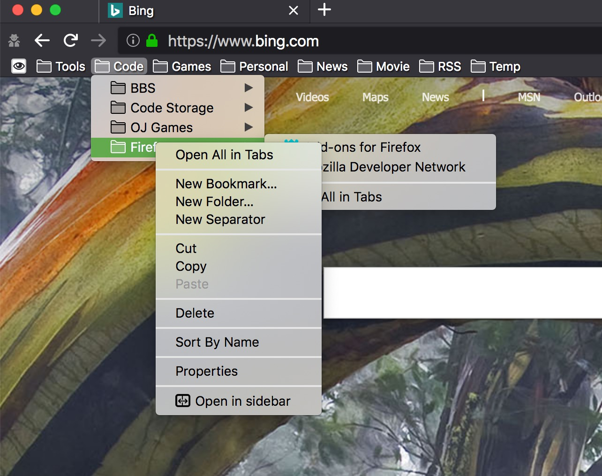
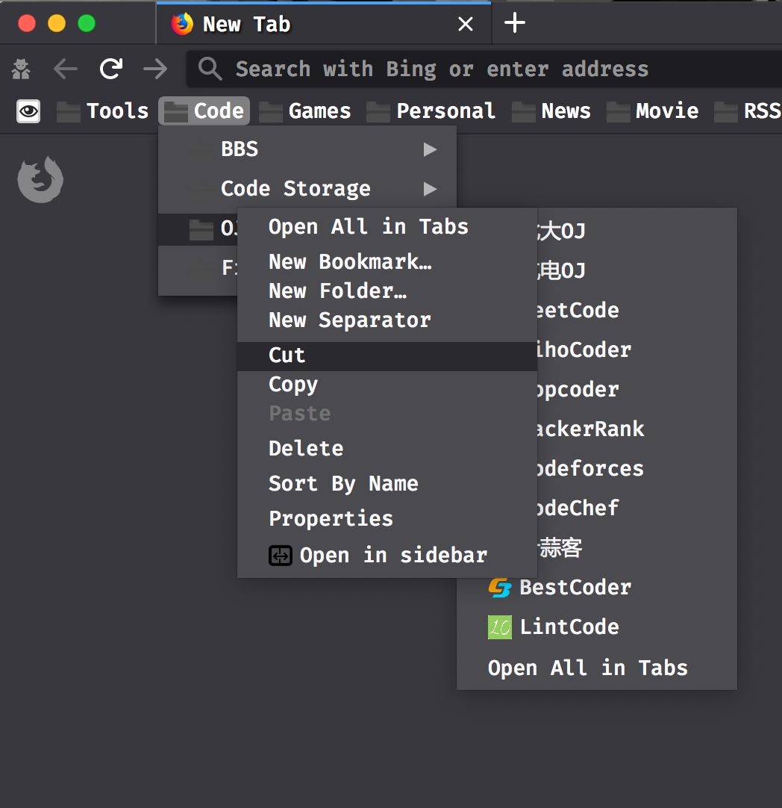

Firefox 完全暗黑主题
---

我是实在想不到什么比较好的名称了... 所以才写了这么个标题. 事情的起因是这样的, 因为最新的 MacOS 已经有了暗黑主题, 所以作为最顺手的浏览器 - Firefox 也遇到了一个新的问题, 就是能否以最完美的姿态迎接这个新的主题.

我们可以先看看正常情况下的火狐浏览器的表现, 即官方的 dark 主题:

> 

可以看到,右键菜单和下来书签都是白色的, 很扎眼. 所以尝试修改了火狐的主题, 新版的效果如下:

> 

从我的个人审美看, 更加喜欢改好的这个主题. 具体的代码在[这](https://github.com/MFirefoxs/firefox-css)

具体的安装方法就是找到火狐的 Profile 文件夹, 然后将代码 `git clone` 到 chrome 文件夹下. 具体的位置可以看[我之前的文章](https://mikecoder.cn/post/165/)

这边推荐下 Fira Code 这个字体, 一开始因为他的 **programming ligatures** 不太习惯, 但是习惯之后, 确实发现代码的可读性变得很高.

虽然对于一般的新手玩家, 都会推荐 Chrome 作为主要浏览器, 不过如果喜欢折腾, Firefox 显然有着更加充分的自由度. 作为一个从 Firefox 3 开始使用的用户, 真的不忍心看到它被埋没啊.
