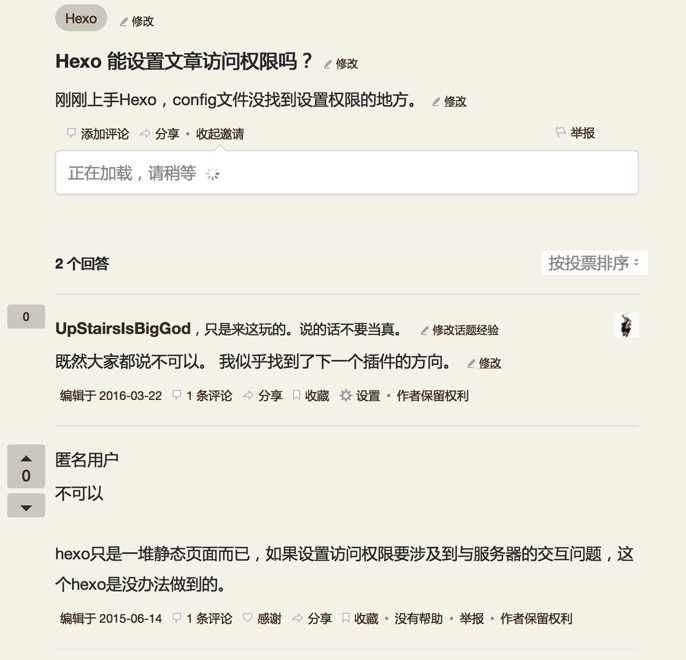

Hexo 博客加密插件简述
---

众所周知，Hexo 是一个很赞的静态博客系统。但是，他有一个很大的缺陷，就是无法对文章进行加密处理。比如，我想对一篇文章做权限控制，例如提问回答可见等等。所以，这就产生了一个这样的需求。

虽然我不是一个 Hexo 用户，但是，看到这样的知乎问答:

> 

我只想说，不想一想实现就直接说不可以的，都不是程序员，一点创造性都没有。顺便吐槽下知乎这个社交平台。

说正事。这个插件的主要用途就是为博客加密，使用方法很简单，这边就不详细描述，因为还有一些没有完善的地方，先期的文档在这:[GITHUB](https://github.com/MikeCoder/hexo-blog-encrypt)

### 原理
其实说穿了，也很简单。因为 Hexo 是纯静态博客系统，所以不可能采用后台密码校验的方式进行处理。所以这个校验就落到了前端上。但是，如果直接 js 进行密码校验，这就好像，我把钥匙放在钥匙孔里，然后对小偷说，你看，我锁好了。

所以这边只可能采用密文的方式，这边感谢开源，这边我使用的是[ brix / crypto-js ](https://github.com/brix/crypto-js) 项目，进行博客加密。加密方式选用的 AES，这个基本可以确保拦截住 99% 的用户了。

有个小细节，就是考虑到中文，我这边是先进行 Base64 编码，然后再 AES，防止出现中文的坑。

### 遇到的坑和 TODO
1. 就是 Hexo 在执行 generate 的时候，并不一定会触发 **"after_post_render"** 事件。只有当文章内容改动和新建文件的时候，才会触发。这个被坑了一下。
2. 现在，模板是直接写在代码里的，当时并没有考虑自定义，这个之后会写成 template 方式。

先凑个数，等刷完了 TODO，再来发布 1.0.0 版本
