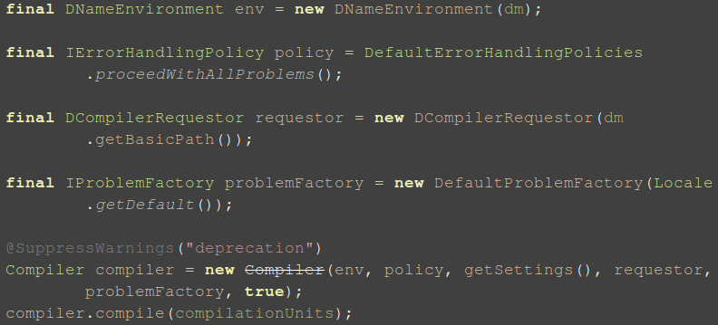
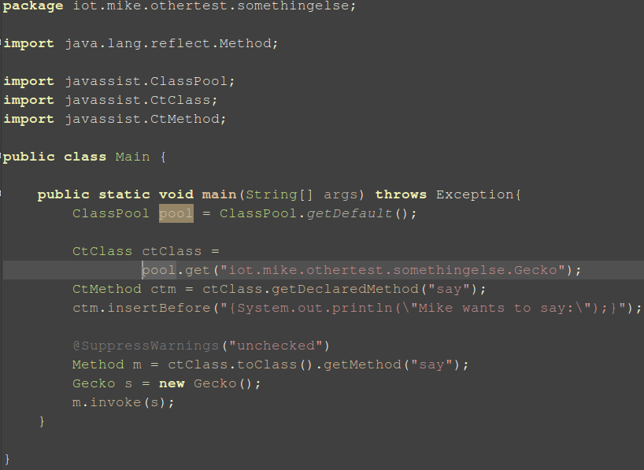

Java字节码增强技术
---
###动态编译
> 关于这个问题，我们需要先了解下Java的运行原理，一般情况下，打开惯用的IDE，
编写Java源代码,再利用IDE提供的功能直接运行Java 程序就可以了。这就行了，但是，
如果你的代码在运行之前不能确定呢(就像OJ)？或者说，你写过JavaBean，你知道写那些setter||getter
方法是多么的蛋疼，大多数的时间和代码都浪费在这些上面了。人生可贵，所以我们需要用更少的时间
写完我们的代码，用更多的时间去陪我们的妹子。

> 所以在这边，我介绍一种比较简单的代码解决办法。一种办法是动态编译代码，用机器去补充代码，
然后动态编译，之后就可以看到完整的代码了，这个办法很类似于[play框架](http://www.oschina.net/p/play-framework)，
关于动态编译代码，我这边有几个办法，第一个就是使用JDK6之后自带的API进行简单的实现。以下就是一个简单的办法:
>
> 
>
> 如果你想看更多的代码和更多的资料，你可以这篇文章，[残剑](http://www.cnblogs.com/liuling/archive/2013/05/09/dynamicCompiler.html)。

> 另外，如果你不是JDK6,就像我一样，你也可以使用JDK中的工 具类 com.sun.tools.javac.Main,不过该工具类只
能编译存放在磁盘上的文件,类似于直接使用javac命令。这便是示例代码:
>
> 
>
> 更多的代码和资料请看这篇文章，[鲁春利之蜉蝣撼大树](http://chrui.iteye.com/blog/1007252)

> 还有一钟办法，那就是使用和play框架一样的方式，采用Eclipse的JDT插件进行动态的编译加载，这边的代码示例会比较长，
现在摘取其中比较重要的代码来看。
>
> 
>
> 如果你想看更多的，请你关注我的开源项目[**Ghoul(食尸鬼)**](https://github.com/MikeCoder/Ghoul)

###字节码增强
> 接下来，就是来说说，字节码增强了。

> 我们就举一个最简单的例子，比如就是说在一个类中现有方法中添加语句。
> 首先，我们需要了解，字节码的内容，内容如下:
>
> 
>
> 图片来源于[Java深度历险](http://www.infoq.com/cn/java-depth-adventure)

> 好了，了解了这些，其实也没什么。。。因为在这边，我们将使用[**Javasist**](http://www.csg.ci.i.u-tokyo.ac.jp/~chiba/javassist/)
作为我们的字节码工具，而不是进行手动的修改，那样真的要烦死了。而这个工程，这是大名鼎鼎的JBoss的子项目。

> 现在我举一个例子，简单的说明一下步骤:

> + 首先，我们有这么一个类:
>
> 
>
> + 然后，我们想在执行这个类的say方法时，多加一句话，因为不知道是谁说的，于是，我们这么做，利用
[**Javasist**](http://www.csg.ci.i.u-tokyo.ac.jp/~chiba/javassist/)的API。
>
> 
>
> + 我们可以得到这样的结果:
>
> 
>
> *这也是我想说的话。*

> 到这，字节码也已经增强了，不知道各位有没有发现，因为在执行say方法之前，确实多了那么一句话。
然后，接下来的事情也就很简单了，比如什么Bean中setter||getter方法的添加，也就易如反掌了。

参考文章:

+ [残剑](http://www.cnblogs.com/liuling/archive/2013/05/09/dynamicCompiler.html)http://www.cnblogs.com/liuling/archive/2013/05/09/dynamicCompiler.html
+ [鲁春利之蜉蝣撼大树](http://chrui.iteye.com/blog/1007252)http://chrui.iteye.com/blog/1007252
+ [Javasist](http://www.csg.ci.i.u-tokyo.ac.jp/~chiba/javassist/)http://www.csg.ci.i.u-tokyo.ac.jp/~chiba/javassist/
+ [Java深度历险](http://www.infoq.com/cn/java-depth-adventure)http://www.infoq.com/cn/java-depth-adventure 
