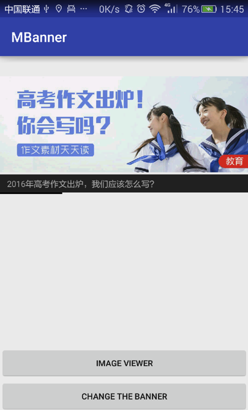

MBanner2 项目(二)---编写可测试的代码、实例展示
---

接上篇的项目基本设计，这次主要是来说具体的实现。

#### 编写可测试的代码
不管在之前的 MBanner 1.0 分支的版本中，还是在借鉴的 QingtingBannerView 中，测试这个环节始终是遗漏的一点。毕竟都是程序员，很少会进行测试驱动开发。所以这次为了解决这个问题，我这边采用了 Junit 进行了部分的代码测试。也是一种测试驱动开发的尝试吧。

具体以具体的代码为例【MBannerLine.java】:

在 1.0 的版本中，MBannerLine 的绘制逻辑和视图的绘画是杂糅在一起的。

```
    protected void onDraw(Canvas canvas) {

        if (mPosition == 0) {
            canvas.drawLine(
                    (mPageSize - 3) * mPageWidth + mPageWidth * mPositionOffset, 0,
                    (mPageSize - 2) * mPageWidth + mPageWidth * mPositionOffset, 0, mPaint);
            canvas.drawLine(0, 0, mPageWidth * mPositionOffset, 0, mPaint);
        } else if (mPosition == mPageSize - 2) {
            canvas.drawLine(
                    (mPosition - 1) * mPageWidth + mPageWidth * mPositionOffset, 0,
                    mPosition * mPageWidth + mPageWidth * mPositionOffset, 0, mPaint);
            canvas.drawLine(0, 0, mPageWidth * mPositionOffset, 0, mPaint);
        } else {
            canvas.drawLine(
                    (mPosition - 1) * mPageWidth + mPageWidth * mPositionOffset, 0,
                    mPosition * mPageWidth + mPageWidth * mPositionOffset, 0, mPaint);
        }

    }
```

这样，除非进行实机的测试，否则是无法发现 bug，比如 mPageSize < 0，这就会引发一个 bug。同时，这部分代码:

```
    public void setPageWidth(int pageSize) {
        mPageSize = pageSize;
        calcPageWidth();
    }

    private void calcPageWidth() {
        this.mPageWidth = this.mWidth / (this.mPageSize - 2);
    }
```

也没有对被除数是否是 0 做校验，实际中，确实出现了 0 即空列表的情况。这种情况下。视图的绘制就会出现问题。

所以，为了改正这部分的逻辑。我对代码进行如下的改动。

```
    @Override
    protected void onDraw(Canvas canvas) {
        if (lineConfig == null) {
            lineConfig = new Line();
        }
        canvas.drawLine(lineConfig.startX, lineConfig.startY, lineConfig.endX, lineConfig.endY, mPaint);
    }

    static class Line {
        public float startX = 0;
        public float endX   = 0;

        public float startY = 0;
        public float endY   = 0;
    }

    public Line calcLineLength(int mPosition, float mOffset) {
        if (lineConfig == null) {
            lineConfig = new Line();
        }

        if (mPosition < 0) {
            mPosition = 0;
        }

        if (this.mPageSize == 0 || mPosition > this.mPageSize) { // no enough page
            this.mPageSize = 1;
            mPosition = this.mPageSize - 1; // show the last one
        }
        float mPageWidth = calcPageWidth(mPageSize);

        if (mPosition == 0) {
            lineConfig.startX = mPageWidth * mOffset;
            lineConfig.endX = mPageWidth + mPageWidth * mOffset;
        } else if (mPosition == mPageSize - 1) {
            lineConfig.endX = mWidth;
            lineConfig.startX = (mPosition) * mPageWidth + mPageWidth * mOffset;
        } else {
            lineConfig.startX = mPageWidth * (mPosition + mOffset);
            lineConfig.endX = mPageWidth * (mPosition + 1 + mOffset);
        }
        return lineConfig;
    }

    public void setPageWidth(int pageSize) {
        mPageSize = pageSize;
    }

    private float calcPageWidth(int mPageSize) {
        if (this.mPageSize == 0) {
            this.mPageSize = 1;  // check the page size
        }
        return this.mWidth / this.mPageSize;
    }
```

将视图的绘制和坐标的计算进行了拆分，这样就可以对其结果进行测试。所以这边也新建了一个 Line 的内部类，用于存储结果。 所以对应的 Junit 测试代码如下 *省略了部分的 test case* :

```
/**
 * @author Mike
 * @project MBanner
 * @date 7/26/16, 4:28 PM
 * @e-mail mike@mikecoder.cn
 */
public class MBannerLineTest extends TestCase {

    private MBannerLine line = new MBannerLine(null);

    @Test
    public void testCalcLineLength() throws Exception {
        line.setMWidth(100);
        line.setPageWidth(5);
        MBannerLine.Line res = line.calcLineLength(1, 0.5f);
        assertEquals(res.startX, 30f);
        assertEquals(res.startY, 0f);
        assertEquals(res.endX, 50f);
        assertEquals(res.endY, 0f);

        res = line.calcLineLength(-1, 0.5f);
        assertEquals(res.startX, 0);
        assertEquals(res.startY, 0);
        assertEquals(res.endX, 100);
        assertEquals(res.endY, 0);

        ...
    }

    @Test
    public void testSetPageWidth() throws Exception {
        line.setPageWidth(-Integer.MAX_VALUE);
        assertNotNull(line);

        line.setPageWidth(-1);
        assertNotNull(line);

        line.setPageWidth(0);
        assertNotNull(line);

        line.setPageWidth(Integer.MAX_VALUE);
        assertNotNull(line);

        ...
    }
}
```

这只是在重构代码中，的一小部分。 还有更多的细节请看源码。

#### 使用方法
在项目的 app 模块里，总共有两个例子，一个是最简单的使用方式，一个是通过 MBanner，做一个类似微信朋友圈的图片浏览器。

##### SimpleExample.java
在这个例子中，我们主要使用了如下的几行代码实现了一个简单的 ADBanner:

```
        final MBannerView mBannerView = (MBannerView) findViewById(R.id.view);
        assert mBannerView != null;
        mBannerView.setEntities(firstEntities);
        mBannerView.showBanner();

        mBannerView.setOnMBannerClickListener(new OnMBannerClickListener() {
            @Override
            public void onClick(int idx) {
                Toast.makeText(getApplicationContext(), "You Click " + idx + " item", Toast.LENGTH_SHORT).show();
            }
        });
        mBannerView.setOnMBannerLongClickListener(new OnMBannerLongClickListener() {
            @Override
            public boolean onLongClick(View v, int idx) {
                Toast.makeText(getApplicationContext(), "You long Click " + idx + " item", Toast.LENGTH_SHORT).show();
                return false;
            }
        });
```

具体的效果如下：
> 

这个效果基本可以满足大部分的 Banner 需求。

接下来就是充分自定下的 ImageViewer 了。效果如下：
> 

这个的配置就比较复杂了，首先需要继承 AMBannerHeaderView 和 AMBannerBottomView 抽象类，实现翻页的效果，和页面的控件。

```
    static class ImageViewerHeaderView extends AMBannerHeaderView {

        TextView imageViewrTitleTV = null;

        public ImageViewerHeaderView(Context context) {
            this(context, null);
        }

        public ImageViewerHeaderView(Context context, AttributeSet attrs) {
            this(context, attrs, 0);
        }

        public ImageViewerHeaderView(Context context, AttributeSet attrs, int defStyleAttr) {
            super(context, attrs, defStyleAttr);
            View.inflate(getContext(), R.layout.layout_image_viewer_header, this);

            imageViewrTitleTV = (TextView) findViewById(R.id.image_viewer_header_title_tv);
        }

        @Override
        public void setIndex(int idx, int total) {

        }

        @Override
        public void setEntity(ArrayList<MBannerEntity> entities, int position) {
            imageViewrTitleTV.setText(entities.get(position).getTitle());
        }

        @Override
        public void setPageScroll(int idx, float offset) {

        }
    }

    static class ImageViewerBottomView extends AMBannerBottomView {

        Button   likeBtn    = null;
        Button   commentBtn = null;
        CheckBox isChosen   = null;

        public ImageViewerBottomView(Context context) {
            this(context, null);
        }

        public ImageViewerBottomView(Context context, AttributeSet attrs) {
            this(context, attrs, 0);
        }

        public ImageViewerBottomView(Context context, AttributeSet attrs, int defStyleAttr) {
            super(context, attrs, defStyleAttr);
            View.inflate(getContext(), R.layout.layout_image_viewer_bottom, this);

            likeBtn = (Button) findViewById(R.id.like_btn);
            commentBtn = (Button) findViewById(R.id.comment_btn);
            isChosen = (CheckBox) findViewById(R.id.is_chosen_cb);

            likeBtn.setOnClickListener(new OnClickListener() {
                @Override
                public void onClick(View v) {
                    Log.i(Constants.TAG + getClass().getCanonicalName() + ".likeBTN", "onclick event");
                }
            });

            commentBtn.setOnClickListener(new OnClickListener() {
                @Override
                public void onClick(View v) {
                    Log.i(Constants.TAG + getClass().getCanonicalName() + ".commentBTN", "onclick event");
                }
            });
        }

        @Override
        public void setIndex(int idx, int total) {

        }

        @Override
        public void setEntity(ArrayList<MBannerEntity> entities, int position) {
            likeBtn.setText(entities.get(position).getTitle().substring(0, 3));
            commentBtn.setText(entities.get(position).getTitle().substring(3, 5));
        }

        @Override
        public void setPageScroll(int idx, float offset) {

        }
    }
```

然后将这两个 View 添加到 MBannerView 中:
```
    mBannerView = (MBannerView) findViewById(R.id.image_viewer_mbv);

    assert mBannerView != null;
    mBannerView.setBottom(new ImageViewerBottomView(mBannerView.getContext()));
    mBannerView.setHeader(new ImageViewerHeaderView(mBannerView.getContext()));

    mBannerView.setOnImageLoadListener(new OnImageLoadListener() {
        @Override
        public void onImageLoad(PhotoView view, String imageUrl) {
            Glide.with(view.getContext()).load(imageUrl).fitCenter().crossFade().into(view);
            view.enable(); // if you enable the photoView, there is no way to enable the onclicklistener or onlongclicklistener
        }
    });
    mBannerView.setEntities(entities);
    mBannerView.showBanner();
```

这里还顺便自定义了 ImageLoad 的监听器，可以方便使用当前项目中采用的加载方式进行加载(默认使用 Glide)。

以上就是，MBanner2 的使用方法以及一些在重构的时候觉得注意的地方。毕竟作为一个安卓初学者，写单元测试还是第一次。之后，还是要保持的。
