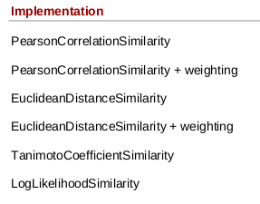

#Mahout中的几种相似度分析的方法解析
---

###算法分析
```
for every item i that u has no preference for yet {
    for every item j that u has a preference for {
        compute a similarity s between i and j
        add u's preference for j, weighted by s, to a running average
    }
}
return the top items, ranked by weighted average
```
> 这个算法和以用户基础所做的推荐系统的算法很像。第三行的代码表示，他是基于item-item的相似性，而不是像之前那样采用user-user的相似性。
不同的是，在用户相似计算的时候，用户的增加和计算时间的增加是线性的，但是在这边，这是指数变化。

###Mahout中的相似度分析类
> 
