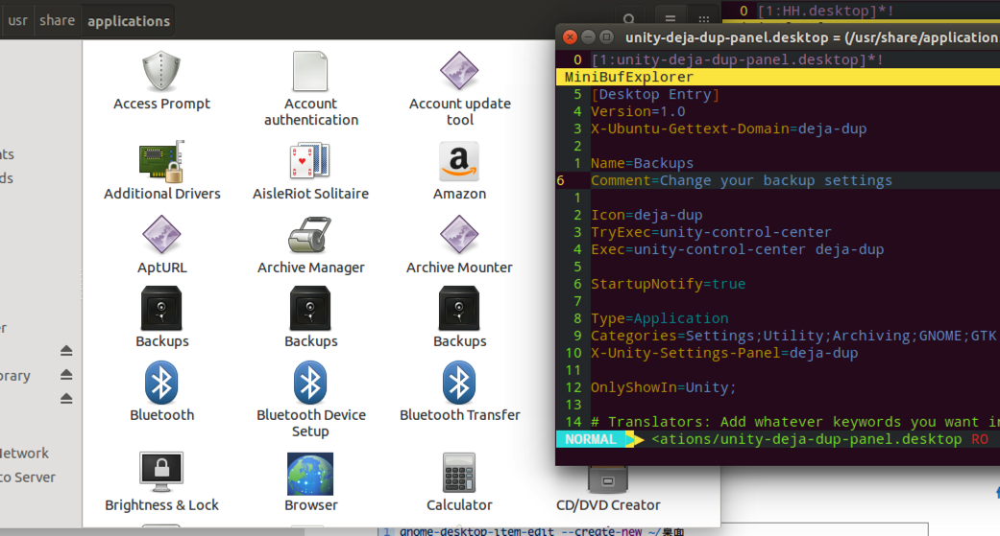

Ubuntu 14.04 添加侧边栏启动图标
---

5月没写博客。于是，水一波吧。。。。这个月本来是在做一个安卓 APP 的开发，等结束了总结下吧。

有朋友遇到个问题，就是 Ubuntu 上下载使用火狐之后，左侧启动栏上的图标很难看。因为系统无法识别这个新启动的应用是属于什么类型的，它的启动图标是什么。

网上有其他的教程，比如这个：[Ubuntu为eclipse添加快捷启动](http://blog.csdn.net/ustczwc/article/details/9005142)。

基本的思路确实是这样，因为 Unity 或者其他的 X-windows 都会基于 */usr/share/applications* 中的启动项来进行图标的配置。

> 

不过这样做有个弊端。就是如果将你下载的软件存放在个人目录下。比如 home，而在 applications 里面添加了启动器，那么就会有可能，其他用户无法使用这个 launcher。如果你说你的电脑上就你一个用户。那么，就不是问题。

而且，作为一个会使用和创造工作并且区别于其他动物的人，有能使用的工具，就必然会找到。

所以，有这么一个工具：[在Ubuntu 12.04左侧启动栏中添加应用程序的启动图标的方法](http://www.heimizhou.com/ubuntu-add-left-launch-bar-icon.html)

> **sudo apt-get install --no-install-recommends gnome-panel**

不过，这篇文章还是会有一个弊端，因为他是在桌面上新建 application 的启动器，所以，桌面上会有一大堆的无用的图标，并且如果固定在启动栏，就会重复。

所以，基于以上两点的综合考虑。就有了这么的一个解决方案：

+ 执行：*sudo apt-get install --no-install-recommends gnome-panel*
+ 执行：*mkdir ~/Launcher* 
    + // 这边为什么要建一个文件夹呢？主要是考虑到之后可能会大量的创建自定义启动项，放在一个文件夹里比较好管理
+ 执行：*gnome-desktop-item-edit --create-new ~/Launcher*
+ 然后就会弹出一个对话框，这边就是让你选择这个启动器的一些参数：
    + 
    + 左上角的图标点击之后，你可以自定义你的启动器图标。
    + 右边的是，你的可执行文件的地址，如果是终端程序，比如 Python 脚本这样的，就可以在 **Type(类型)** 那边选择 **Application in Terminal(终端执行)**
+ 全部搞定之后，然后到 *~/Launcher* 目录下，找到这个启动器，双击打开，就可以看到启动栏上有这个图标了。
+ 然后再右击选择固定到启动栏。
+ Done
