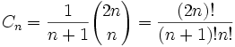

Wordpress 的 Github Fetcher 插件
---

关于最新的介绍和使用安装方式, 建议参考 [Github 的 ReadMe.md](https://github.com/MikeCoder/wp-github-fetcher).

好长时间没有写博客, 主要的原因是比较忙. 这段时间要搞定工作上的事情, 还要处理房屋的装修, 顺便还要准备结婚的事情, 有点焦头烂额. 所以, 也是上班的时候, 抽了一个小时搞定了这个插件.

我个人写博客的习惯是, 本地上写好了博客, 然后提交到自己的 git 库里面, 然后 push 到 github 上. 之前在用 emlog 的时候, 也是自己写了一个同步的插件来帮助同步, 加上 github 的 markdown 渲染效果确实可以, 同时还可以用他们的图片作为 CDN 的加速.

具体细节也不多说, 然后就是具体的使用方法.

#### 如何安装

直接到 github 的 release 页面, 下载 zip 包, 然后通过上传文件的安装方式安装该插件就可以了.

*TODO: 将插件上传到官方的插件中心*


#### 如何使用

通常, 当安装插件之后, 你会看到在编辑器的右侧看到一个对话框, 输入你的 github 博客文章地址, 对于我来说, 通常而言就是 `https://github.com/xxx/xx.md`, 然后按 **Sync** 按钮, 之后就可以看到同步好的博客出现在编辑器里了.

> 

目前, 这个插件只支持老版本的编辑器, 对于最新的编辑器 - Gutenberg 并不支持. *(说句实话, 新版本的编辑器太难用...)*

最后, 如果觉得有用, 有新的需求, 欢迎在 github 上提交 issue.


如果担心是否能同步图片和代码, 可以参考如下的测试部分:

```
using namespace std;

class Solution {
 public:
  void dfs(vector<vector<int>> &grid, set<pair<int, int>> &points, int idx,
           int idy) {
    if (0 <= idx && idx < (int)grid.size() && 0 <= idy
        && idy < (int)grid[0].size()) {
      if (points.find(pair<int, int>(idx, idy)) != points.end()
          || grid[idx][idy] == 0) {
        return;
      }

      points.insert(pair<int, int>(idx, idy));
      dfs(grid, points, idx - 1, idy);
      dfs(grid, points, idx, idy - 1);
      dfs(grid, points, idx + 1, idy);
      dfs(grid, points, idx, idy + 1);
    }
  }

  int largestIsland(vector<vector<int>> &grid) {
    set<pair<int, int>> points;
    vector<vector<pair<int, int>>> groups(
        grid.size(),
        vector<pair<int, int>>(grid[0].size(), pair<int, int>(0, 0)));

    int maxSize = 0;
    int groupIdx = 1;

    vector<pair<int, int>> zeros;
    for (int i = 0; i < (int)grid.size(); i++) {
      for (int j = 0; j < (int)grid[0].size(); j++) {
        if (grid[i][j] == 0) {
          zeros.push_back(pair<int, int>(i, j));
        } else if (grid[i][j] == 1 && groups[i][j].first == 0) {
          points.clear();
          dfs(grid, points, i, j);

          for (auto p : points) {
            groups[p.first][p.second].first = groupIdx;
            groups[p.first][p.second].second = points.size();
          }

          maxSize = points.size();

          groupIdx++;
        }
      }
    }

    for (auto z : zeros) {
      set<int> surrounds;

      int count = 1;
      // down
      if (z.first < (int)grid.size() - 1
          && groups[z.first + 1][z.second].second != 0
          && surrounds.find(groups[z.first + 1][z.second].first)
                 == surrounds.end()) {
        surrounds.insert(groups[z.first + 1][z.second].first);
        count += groups[z.first + 1][z.second].second;
      }
      // up
      if (z.first > 0 && groups[z.first - 1][z.second].second != 0
          && surrounds.find(groups[z.first - 1][z.second].first)
                 == surrounds.end()) {
        surrounds.insert(groups[z.first - 1][z.second].first);
        count += groups[z.first - 1][z.second].second;
      }
      // right
      if (z.second < (int)grid[0].size() - 1
          && groups[z.first][z.second + 1].second != 0
          && surrounds.find(groups[z.first][z.second + 1].first)
                 == surrounds.end()) {
        surrounds.insert(groups[z.first][z.second + 1].first);
        count += groups[z.first][z.second + 1].second;
      }
      // left
      if (z.second > 0 && groups[z.first][z.second - 1].second != 0
          && surrounds.find(groups[z.first][z.second - 1].first)
                 == surrounds.end()) {
        surrounds.insert(groups[z.first][z.second - 1].first);
        count += groups[z.first][z.second - 1].second;
      }

      maxSize = max(maxSize, count);
    }

    for (int i = 0; i < grid.size(); i++) {
      for (int j = 0; j < grid[0].size(); j++) {
        cout << groups[i][j].first << ':' << groups[i][j].second << ' ';
      }
      cout << endl;
    }

    return maxSize;
  }
};
```

图片测试: 
