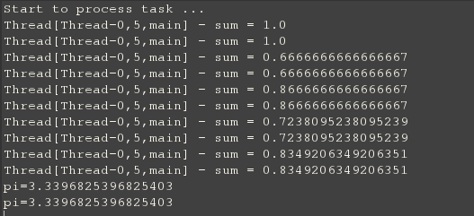

像NodeJS一样写Java(二)
---
在上篇文章中[像NodeJS一样写Java(一)](http://mikecoder.net/?post=95)中，我们已经了解了一个简单的单线程异步框架的基本构成和编写方式。

下面，我们需要聊的是有关这个框架的一些改进，具体的代码可以在我的GITHUB上找到，地址为:[https://github.com/MikeCoder/NodeJava](https://github.com/MikeCoder/NodeJava),相较于之前的那个，做的改进有下：

1. 添加了任务调度模块
2. 完善了任务结束之后，资源回收问题


####关于任务调度模块
我添加了TaskDispatcher接口，接口的定义如下：
```
public interface TaskDispatcher {
    // getTask() Method must be blocking when empty
    public Task getTask() throws InterruptedException;
    public void submitTask(Task task, int level);
}
```

+ submit()方法则为提交任务的接口，其中的level有如下的几个分级:

```
public static final int IMPORTANT = 0;
public final static int HIGH      = 1;
public final static int LOW       = 2;
public static final int NORMAL    = 3;
public static final int NONE      = 4;
```
*如果没有指定优先级，默认为NORMAL*

+ getTask()方法为TaskExecutor提供一个接口，方便其获取调度之后的任务。并且必须是一个阻塞方法，当任务为空，必须阻塞，在自定义分发者的时候需要注意的。

```
while ((!isShutdown) && (!isStop)) {
    try {
        Task task = dispatcher.getTask();
        task.execute();
    } catch (InterruptedException e) {
        e.printStackTrace();
    }
}
```

> 该框架提供一个默认TaskDispather，其中的调度方法是基于优先级的调度，对各个不同优先级的任务进行轮寻，优先执行优先级高的任务。调度代码如下：

```
@Override
public Task getTask() throws InterruptedException {
    while (!isShutdown) {
        for (LinkedList<Task> leveltasks : tasks) {
            if (!leveltasks.isEmpty()) {
                currentnum.decrementAndGet();
                finishnum.incrementAndGet();
                return leveltasks.pop();
            }
        }
        empty.acquire(); // empty is a Semaphore
    }
    return null;
}
```

####关于资源回收
我在TaskEventEmitter接口中添加了一个函数，即**finish()**:
```
// invoked when the whole task finished
protected final void finish() {
    eventHandlerMap.clear();
}
```
所以在编写事件的时候，需要在任务结束时触发"done"事件，同时，为了防止用户的自定义"done"事件，同时在类初始化的时候即注册"done"事件。为了防止资源释放出现，我屏蔽了用户的自定义事件处理器。如果用户提交了自定义的"done"事件处理器，即抛出异常:
```
@Override
public void on(String eventName, EventHandler handler) {
    checkEventName(eventName);  // check whether eventname is "done", 
                                //if true throw a InterruptedException
    if (!eventHandlerMap.containsKey(eventName)) {
        List<EventHandler> eventHandlerList = new LinkedList<EventHandler>();
        eventHandlerMap.put(eventName, eventHandlerList);
    }
    eventHandlerMap.get(eventName).add(handler);
}
```
故，在进行事件的激活上，需要用户在最后事件的结束时添加以下代码:
```
task.emit(Task.NONE, "done", null);
```
或者是:
```
task.emit("done", null);
```
*PS:前者指定了任务的优先级。*


欢迎大家使用该框架进行编写程序。执行方法如下：
```
git clone git@github.com:MikeCoder/NodeJava.git
```
然后进入NodeJava目录，打开IDE，进行导入，然后执行**Example.java**中的Main函数:
```
public static void main(String[] args) {
    // use Default TaskExecutor and Default TaskDispatcher
    final TaskManager manager = new TaskManager(); 
    // you can use yourself's executor and dispatcher only if you 
    // implements the TaskDispatcher and TaskExecutor interface and use 
    // TaskManager(TaskExecutor executor, TaskDispatcher dispatcher) 
    // to ceate a TaskManager
    TaskExecutor executor = manager.getExecutor();
    manager.start();
    Task piTask = TaskHelper.createPiTask(executor, 5);
    Task piTask2 = TaskHelper.createPiTask(executor, 5);
    executor.submit(piTask, Task.IMPORTANT);
    executor.submit(piTask2, Task.IMPORTANT);
}
```
你就可以看到两个计算PI的任务在一个线程中交替执行了。
效果图如下：
> 

当然，你也可以编写自己的异步任务，然后放入框架中运行。

####总结
其实，最终到底，是人思想的问题。Java和NodeJS真的相差大？反正我是觉得，不管用什么语言，都可以在一堆库的帮助下完全变成另外的一个样子，就像这个框架一样，将一个OOP的语言，变成了一个基于事件的编程模型。

相较于语言，更重要的是其中的思想，反过来说，如果在NodeJS中，大范围的出现CPU耗时的代码段(当然，只是假设)，那么，响应必定会慢，这和CPU的时间片是一样的。所以，重要的是如何将一个任务分成足够小的片段，并且进行组织，而不是使用何种语言。进行编写程序。

当然，这是个人看法。

Happy yourself.