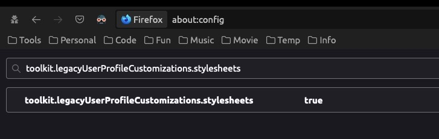
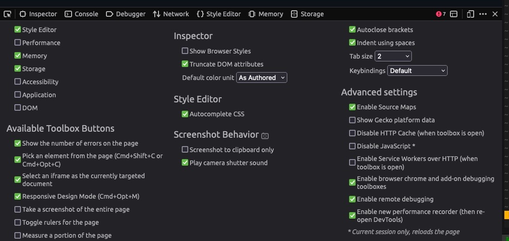
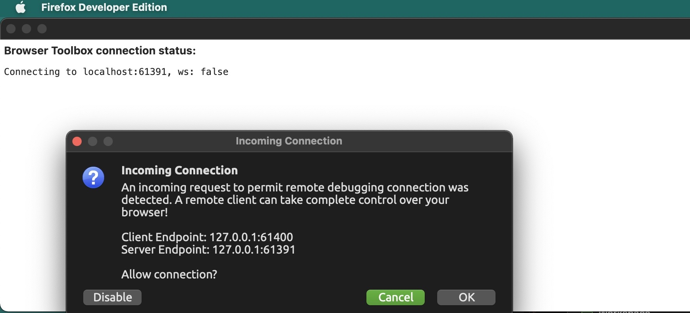
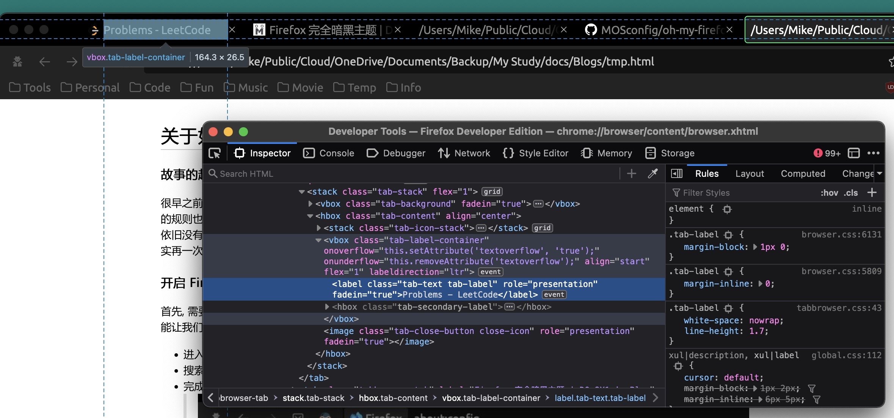
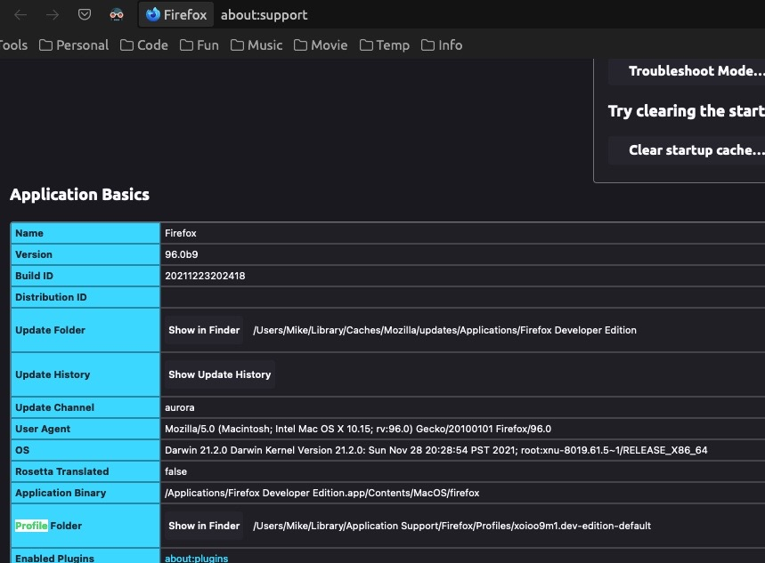
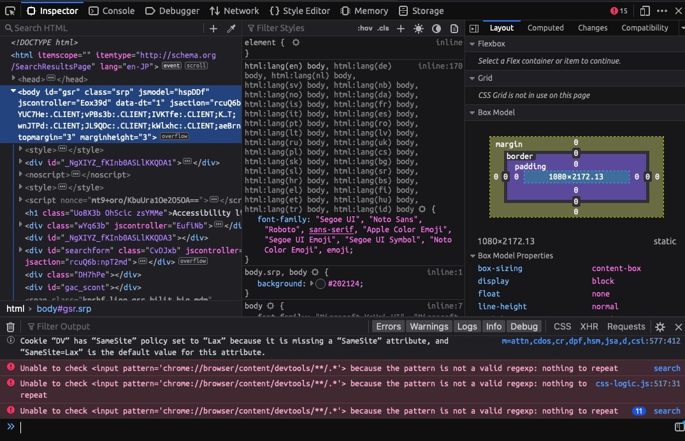

关于如何编写 Firefox 完全定制化主题
---

#### 故事的起因
很早之前我写过一篇博客 - [<Firefox 完全暗黑主题>](https://d0n9x1n.dev/post/396/). 用来描写如何进行编写 Firefox 的主题. 但是随着 Firefox 的持续更新, 很多预先设置的规则也渐渐失效了, 所以本着授人以鱼不如授人以渔的想法, 决定在这里具体说一下如何进行自定义的修改.
三年过去了, Edge 和 Chrome 依旧没有能解决我的痛点 - 自定义所有界面的字体与字体大小. 本来还想着通过一个过渡时期之后, 彻底转移到 Edge 浏览器上, 可惜啊, 事实再一次证明, 只有 Firefox 才是 Geeker 最喜欢的浏览器.

#### 开启 Firefox UserProfile Customization
首先, 需要了解到, 自定义 Native UI 属于 Legacy Code, 也就是在现阶段的火狐开发计划中, 这部分的内容并不保证会一直有效. 所以, 为了能让我们的自定义 css 能成功使用, 需要手动开启 `toolkit.legacyUserProfileCustomizations.stylesheets`. 方法如下:

+ 进入 about:config 页面
+ 搜索 `toolkit.legacyUserProfileCustomizations.stylesheets` 并将其设置为 true (双击)
+ 完成后如下图所示:
> 

#### 打开火狐的 remote debugger
这一步的目的就是能让我们使用 Web Dev Tools 直接 Debug Firefox 的用户界面.

+ 打开 Web Dev Tools, 一般是直接按 F12 可以呼出
+ 点击右上角的 `...` 来打开 Settings
+ 在 Advanced settings 中的 Enable remote debugging 以及 enable browser chrome and add-on debugging toolboxes
+ 完成后如下图所示:
> 

#### 开启 Remote Debugger Console
一般在进入这一步的时候, 需要重启你的火狐浏览器

+ 从右上角的菜单中进入 More Tools -> Browser Tools
+ 完成后如下图所示:
> 
+ 点击 Ok 之后, 就来到了全 Firefox 可用的 Web Dev Tools Console 了.
> 

之后的故事, 就变了常规的前端开发.

#### 持久化个性 CSS
之前的步骤中, 我们能够就地更换对应的 css, 但是再重启之后, 这部分的数据依旧会丢失, 这就需要我们将对应的 rules 写入 Profiles Folder

+ 找到自己 Firefox 对应的 Profiles Folder
+ 通过 Help -> More troubleshooting information 来定位自己的 Profile Folder
+ 完成后如下图所示:
> 
+ 点击 Show in Finder 然后在该目录下新建一个文件夹 `chrome`
+ 随后在 `chrome` 中新建两个文件 `UserChrome.css` 和 `UserContent.css`
+ 将在上一步中自定义的 css 写入 `UserChrome.css` 中重启火狐即可看到最近的修改.

#### Trouble Shooting
在进行开发的时候, 我发现有了一个 Bug, 那就是 Firefox remote debugging console 在打开几次之后便无法打开. 尝试多次后依旧无效. 最后的解决办法是删除 `Profiles Folder/chrome_debugger_profile` 文件夹即可.

原理就是重置 Remote Debugging 相关配置.

#### 修改 Web Dev Tools
以上的做法只能保证对一般 UI 界面进行. 如果我们想自定义自己的 Web Dev Tools 呢? 比如像这样自定义 Tab 字体与大小:
> 

那就又是另个故事了. 不过简单来说, 可以参考 - [**这个项目**](https://github.com/MOSconfig/oh-my-firefox), 来进行编辑属于自己的 Dev Tools.
