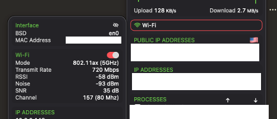
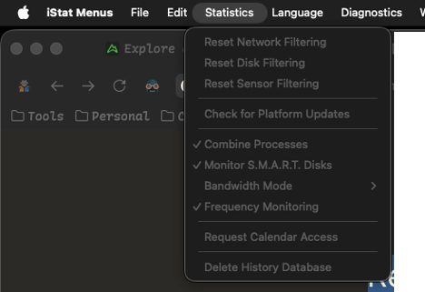
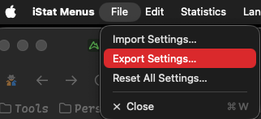

解决 istat menus 添加 filter 之后无法复原的问题
---

## 故事的原由
一开始都是因为不小心, 一直没注意左上角 interface 右手边那个隐藏按钮, 没想到这次
因为好奇, 就点了一下, 就发现该网络接口已经无法显示, 在 istat menus 里面找了半天
也没有什么结果.



## 解决办法
### Option 1: 直接左上角找到 reset filter 那边, 然后点击 reset

比如这个网站说的那样:

+ [Resetting hidden disks, sensors and network interfaces](https://bjango.com/help/istatmenus7/resetting/)

很遗憾, 我的电脑上, 该选项被 disable 了. 如下图一样:



所以这个方案就没什么可以继续研究下去的必要了.

### Option 2: 导出 settings, 然后删除对应的 filter 列表再重新导入.

这个应该是我第一个想出来的, 因为我实在是没招了, 就找了这个法子. 先导出你当前的配置:



其中去找这一段代码:

```xml
<key>Network.Menu.Filtering</key>
<array>
</array>
```

如果你看到其中的 array 部分有其他的数据, 直接删掉, 然后重新 import 即可.

## 写在最后
没想到离开中国之后, 这居然才是第二篇博客. 从 2012 年开始学习建站, 写博客, 到现在
也维护了 13 年了. 本想着以后有了工作就可以在开源的世界做出贡献, 没想到生活的压力
还是超出了想象. 希望以后能好吧.


