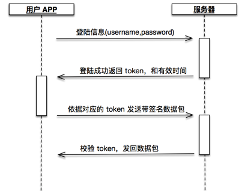

设计自认为优雅的接口（上）
===
最近有个设计上的需求，我们之前基于 opencart 的一个电商项目，需要进行对应的 APP 开发。这个就牵涉到了很多的问题。

1. opencart 之前的登陆表示是基于 session 的，但是如果使用 APP，APP 可能会使用 H5 和 Native 两种形态，这边有可能会产生一个 session 的不统一。
2. 之前使用的基于 url 的方式进行访问的页面，如何比较优雅的实现对应的移动 API。
3. API 部分会涉及到一个升级问题，如何优雅的实现升级，而且不会影响到先前版本的使用。
4. 其次是我们 APP 上会实现支付部分，而这个部分有可能基于 H5 来做，但是 APP 的开发的说法，支付的 SDK 是 Native 的，如何做到在 H5 上优雅的支付，又是个问题。
5. API 使用 json 做为协议，那么如何尽可能的减少结构体或者类的使用(照顾强类型的 json 解析)。

这次主要讲下第一点和第二点的我的解决办法。顺带说下第三点。

#### 第一个问题：
这边就是一个如何将 session 显式的从 cookie 转移到每次请求的 request body 中。这个可以通过模仿 oauth2 的协议进行。具体的流程图如下：
> 

1. 这边主要注意的是 token 的有效时间。和数据包的签名。由于 token 是明文，恐怖分子可以使用中间人攻击进行数据的窃取，轻易的获得用户 token，而掌握了 token 之后，如果数据包没有对应的签名，恐怖分子很容易进行数据包的篡改，然后发回服务器。所以这边我们会对数据包的数据进行签名。
2. 举几个例子，request body 的协议如下:
    ```
    # 以登陆之后获取用户信息为例,使用 GET 方法访问 https://url/userinfo/{uid}
    head:
        token : 用户登陆凭证
        sign  : 用户对 body 中的内容签名值
    body:
        infoscope : 用户获取信息的范围
        timestamp : 发送请求时的时间戳

    # 以登陆之后修改用户密码为例，使用 POST 方法访问 https://url/userinfo/{edit}
    head:
        token : 用户登陆凭证
        sign  : 用户对 body 中的内容签名值
    body:
        timestamp : 发送请求时的时间戳
        infoscope : password
        password : 用户原有密码
        chpassword : 用户修改之后的密码
    ```
3. 这边之所以使用 timestamp，主要是进行一个 token 的有效期判定，同时为了防篡改,timestamp 也在 sign 的范围里。
4. 至于服务器端如何进行用户的判定。也是相对来说比较简单。opencart 原有架构是基于 session 的，登陆之后，他会将用户的 `customer_id` 存放在 session 里面，然后在每次请求的同时，会根据 customer_id 初始化用户对象。然后这边我们重新设计了一个 API，APP 用户访问之后，我们会通过用户的 token 查询缓存。判断用户是否有权进行该项操作。
5. 验证通过之后，我们会进行用户的初始化。达到了一个用户的登录状态保持。
6. 如果登陆超时，或者无权，我们会相应返回对应的 json 值。

#### 第二个问题：
首先我们的指导设计思想就是 RestFul。

1. 所有的API部署在专用域名之下。
2. 充分利用 HTTP 协议，如 Response Code 和 Request Method
3. 安全起见，使用 https 代替 http

##### 第一点
1. 我们的所有 API 部署在 **https://url/mobile/api/** 下,如
    + GET https://url/api/userinfo/{uid}
    + GET https://url/api/products/
2. 这边顺带说下我们如何解决版本问题。一般来说有两种方式：
    + 将版本号写到 url 中
    + 将版本号写到 Request Body 中或者 Header 中

    这边我们采用直接写到 url 中，简单粗暴

##### 第二点
1. 我们所知道 Http Response Code 如下：
    + 200 OK - [GET]：服务器成功返回用户请求的数据，该操作是幂等的（Idempotent）
    + 201 CREATED - [POST/PUT/PATCH]：用户新建或修改数据成功。
    + 202 Accepted - [*]：表示一个请求已经进入后台排队（异步任务）
    + 204 NO CONTENT - [DELETE]：用户删除数据成功。
    + 400 INVALID REQUEST - [POST/PUT/PATCH]：用户发出的请求有错误，服务器没有进行操作。
    + 401 Unauthorized - [*]：表示用户没有权限（令牌、用户名、密码错误）。
    + 403 Forbidden - [*] 表示用户得到授权（与401错误相对），但是访问是被禁止的。
    + 404 NOT FOUND - [*]：用户发出的请求针对的是不存在的记录。
    + 406 Not Acceptable - [GET]：用户请求的格式不可得。
    + 410 Gone -[GET]：用户请求的资源被永久删除，且不会再得到的。
    + 422 Unprocesable entity - [POST/PUT/PATCH] 当创建一个对象时，发生一个验证错误。
    + 500 INTERNAL SERVER ERROR - [*]：服务器发生错误，用户将无法判断发出的请求是否成功。
2. 通过 Response Code 简单的返回请求结果，便于 APP 端处理(减少解析步骤)
3. 其次是通过 Http Requset Method 的妙用，减少 url 的数量。比如：

    https://url/userinfo/{uid}
    + GET 方法是获得用户的信息
    + POST 方法是修改用户的信息
    + DELETE 方法是删除用户
    + PUT 方法是添加新的用户

##### 第三点
为了安全

**PS**:*TO BE CONTINUE....*
