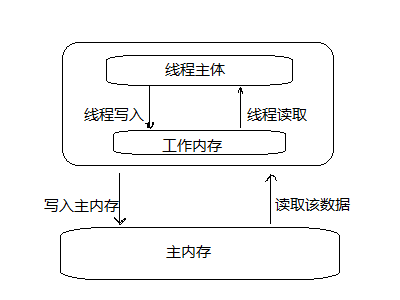
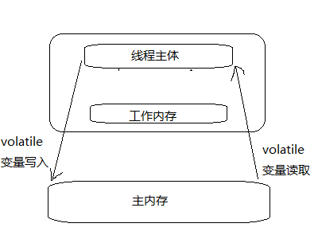

第十二章、Java内存模型与线程
---
###1. 关于volatile变量的特殊规则
>* 每个线程都运行在栈内存之中，每个线程都有自己的工作内存空间，比如说寄存器，高速缓冲储存器等，线程的计算一般是通过在工作内存进行交互的，原理如下：
>		* 
>* 但是使用volatile关键字的变量则是所有线程可见的，原理如下：
>		* 
>* 我之前的一篇文章阐述了为什么使用volatile为什么不能使用volatile进行线程安全编程。[volatile并不能保证数据同步](http://mikecoder.net/?post=37)

###2. 关于long和double的双字节变量的特殊规则(我也第一次知道)
>* Java虚拟机没有对这种64位数据类型的load,store,read和write进行原子性保护
>* 如果多个线程共享一个未被volatile修饰的long或者double类型的时候，有可能会读取到一个只修改了一半的数值
>* 在JDK1.5之前，如果有大并发的编程，都需要在共享的long,double变量前加上volatile关键字
>* 现在在主流的商用虚拟机中，已经普遍将64位数据操作视为原子操作。

###3. 几个基本的概念
>1. 原子性
>		* Java内存模型中，原子性变量的操作包括read,load,assign,use,store和write
>		* 如果为了提供更大规模的原子性保证，可以使用lock类和同步化关键字
>2. 可见性
>		* 可见性是当一个线程改变了共享变量的值，其他线程能够立刻得知这个修改。
>		* 拥有可见行特点的关键字有(volatile,synchronized,final)
>3. 有序性
>		* 在本线程内观察，所有的操作都是有序的，如果在另一个线程内观察，所有的操作都是无序的。